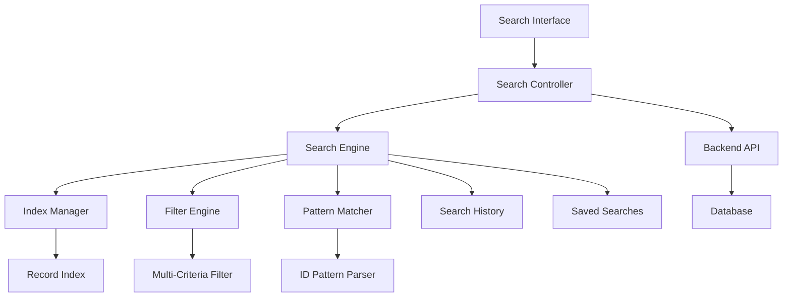
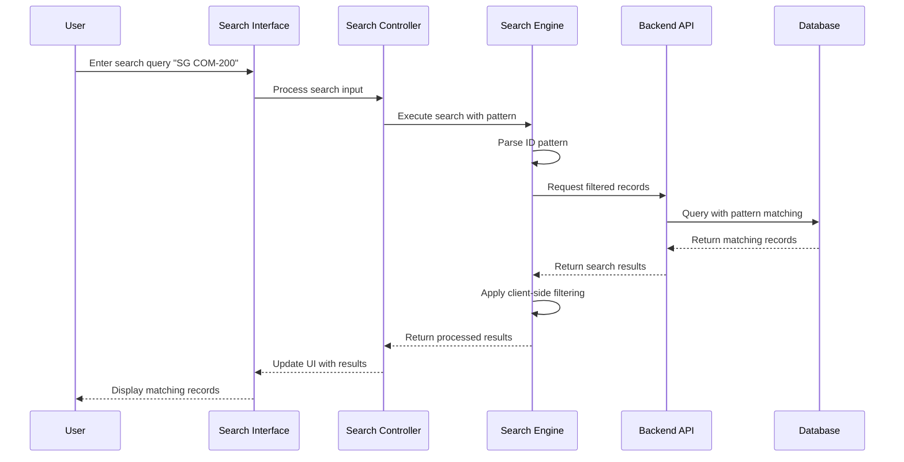

# Enhanced Record Search Design

## Overview

The Enhanced Record Search system builds upon the existing search functionality in the Singapore Phone Detect application to provide powerful, flexible search capabilities. The design focuses on helping users quickly find specific records using ID patterns, advanced filters, and intelligent search suggestions while maintaining excellent performance.

## Architecture

### High-Level Architecture



### Component Interaction Flow



## Components and Interfaces

### 1. Enhanced Search Interface

**Purpose**: Provides the user interface for all search functionality

**Key Features**:
- Enhanced search input with auto-complete
- Advanced search modal with multiple filter fields
- Search suggestions dropdown
- Search history panel
- Quick search buttons for common patterns
- Search result highlighting

**Interface Elements**:
```javascript
// Enhanced search input component
class EnhancedSearchInput {
    constructor(containerId, options = {}) {
        this.container = document.getElementById(containerId);
        this.options = {
            placeholder: "Search records (try 'SG COM-200*' or 'range:2001-2010')",
            showSuggestions: true,
            showHistory: true,
            debounceMs: 300,
            ...options
        };
    }
    
    // Methods
    initialize()
    showSuggestions(suggestions)
    showHistory(searches)
    clearSearch()
    setSearchValue(value)
}

// Advanced search modal
class AdvancedSearchModal {
    constructor() {
        this.filters = {
            id: '',
            phone: '',
            companyName: '',
            address: '',
            email: '',
            website: '',
            status: 'all',
            dateRange: null
        };
    }
    
    // Methods
    open()
    close()
    applyFilters()
    resetFilters()
    getFilterCriteria()
}
```

### 2. Search Engine

**Purpose**: Core search processing and pattern matching logic

**Key Features**:
- ID pattern parsing and matching
- Multi-criteria filtering
- Search result ranking
- Performance optimization with indexing
- Search history management

**Core Classes**:
```javascript
class SearchEngine {
    constructor(recordData) {
        this.records = recordData;
        this.indexManager = new IndexManager(recordData);
        this.patternMatcher = new PatternMatcher();
        this.filterEngine = new FilterEngine();
        this.searchHistory = new SearchHistory();
    }
    
    // Main search method
    async search(query, filters = {}) {
        const parsedQuery = this.patternMatcher.parseQuery(query);
        const filteredRecords = await this.filterEngine.apply(this.records, filters);
        const matchedRecords = this.patternMatcher.match(filteredRecords, parsedQuery);
        
        this.searchHistory.add(query, filters);
        return this.rankResults(matchedRecords, parsedQuery);
    }
    
    // Pattern-specific methods
    searchByIdPattern(pattern)
    searchByRange(startId, endId)
    searchWithWildcards(pattern)
    getSuggestions(partialQuery)
}

class PatternMatcher {
    // ID pattern matching
    parseIdPattern(pattern) {
        // Parse patterns like "SG COM-200*", "SG COM-2001 to SG COM-2010"
        const patterns = {
            wildcard: /^(.+)\*$/,
            range: /^(.+?)\s+to\s+(.+)$/,
            exact: /^(.+)$/
        };
        
        for (const [type, regex] of Object.entries(patterns)) {
            const match = pattern.match(regex);
            if (match) {
                return { type, match: match.slice(1) };
            }
        }
        
        return { type: 'exact', match: [pattern] };
    }
    
    matchIdPattern(recordId, pattern) {
        const parsed = this.parseIdPattern(pattern);
        
        switch (parsed.type) {
            case 'wildcard':
                return recordId.startsWith(parsed.match[0]);
            case 'range':
                return this.isIdInRange(recordId, parsed.match[0], parsed.match[1]);
            case 'exact':
                return recordId.toLowerCase().includes(parsed.match[0].toLowerCase());
        }
    }
    
    isIdInRange(recordId, startId, endId) {
        // Extract numeric part for range comparison
        const extractNumber = (id) => {
            const match = id.match(/(\d+)$/);
            return match ? parseInt(match[1]) : 0;
        };
        
        const recordNum = extractNumber(recordId);
        const startNum = extractNumber(startId);
        const endNum = extractNumber(endId);
        
        return recordNum >= startNum && recordNum <= endNum;
    }
}
```

### 3. Filter Engine

**Purpose**: Handles multi-criteria filtering and advanced search options

**Key Features**:
- Multiple simultaneous filters
- Date range filtering
- Status-based filtering
- Performance-optimized filtering

```javascript
class FilterEngine {
    async apply(records, filters) {
        let filteredRecords = [...records];
        
        // Apply each filter sequentially
        if (filters.id) {
            filteredRecords = this.filterById(filteredRecords, filters.id);
        }
        
        if (filters.phone) {
            filteredRecords = this.filterByPhone(filteredRecords, filters.phone);
        }
        
        if (filters.status && filters.status !== 'all') {
            filteredRecords = this.filterByStatus(filteredRecords, filters.status);
        }
        
        if (filters.dateRange) {
            filteredRecords = this.filterByDateRange(filteredRecords, filters.dateRange);
        }
        
        return filteredRecords;
    }
    
    filterById(records, idPattern) {
        const patternMatcher = new PatternMatcher();
        return records.filter(record => 
            patternMatcher.matchIdPattern(record.Id || '', idPattern)
        );
    }
    
    filterByStatus(records, status) {
        const isValid = status === 'valid';
        return records.filter(record => 
            (record.Status === true || record.Status === 1) === isValid
        );
    }
}
```

### 4. Search History and Saved Searches

**Purpose**: Manages search history and allows users to save frequently used searches

```javascript
class SearchHistory {
    constructor(maxItems = 10) {
        this.maxItems = maxItems;
        this.history = this.loadFromStorage();
    }
    
    add(query, filters = {}) {
        const searchItem = {
            query,
            filters,
            timestamp: new Date().toISOString(),
            id: this.generateId()
        };
        
        // Remove duplicates and add to front
        this.history = this.history.filter(item => 
            item.query !== query || JSON.stringify(item.filters) !== JSON.stringify(filters)
        );
        
        this.history.unshift(searchItem);
        
        // Limit history size
        if (this.history.length > this.maxItems) {
            this.history = this.history.slice(0, this.maxItems);
        }
        
        this.saveToStorage();
    }
    
    getHistory() {
        return this.history;
    }
    
    clear() {
        this.history = [];
        this.saveToStorage();
    }
}

class SavedSearches {
    constructor() {
        this.searches = this.loadFromStorage();
    }
    
    save(name, query, filters = {}) {
        const searchItem = {
            id: this.generateId(),
            name,
            query,
            filters,
            createdAt: new Date().toISOString()
        };
        
        this.searches.push(searchItem);
        this.saveToStorage();
        return searchItem.id;
    }
    
    load(id) {
        return this.searches.find(search => search.id === id);
    }
    
    delete(id) {
        this.searches = this.searches.filter(search => search.id !== id);
        this.saveToStorage();
    }
    
    getAll() {
        return this.searches;
    }
}
```

## Data Models

### Search Query Model
```javascript
const SearchQuery = {
    query: String,           // Raw search query
    filters: {
        id: String,          // ID pattern filter
        phone: String,       // Phone number filter
        companyName: String, // Company name filter
        address: String,     // Address filter
        email: String,       // Email filter
        website: String,     // Website filter
        status: String,      // 'all', 'valid', 'invalid'
        dateRange: {
            start: Date,
            end: Date
        }
    },
    options: {
        caseSensitive: Boolean,
        exactMatch: Boolean,
        useWildcards: Boolean
    }
};
```

### Search Result Model
```javascript
const SearchResult = {
    records: Array,          // Matching records
    totalCount: Number,      // Total matches found
    query: SearchQuery,      // Original query
    executionTime: Number,   // Search execution time in ms
    suggestions: Array,      // Alternative search suggestions
    pagination: {
        currentPage: Number,
        totalPages: Number,
        recordsPerPage: Number
    }
};
```

## Error Handling

### Search Error Types
1. **Pattern Parse Errors**: Invalid search patterns or syntax
2. **Performance Timeouts**: Searches taking too long
3. **Filter Validation Errors**: Invalid filter criteria
4. **Storage Errors**: Issues saving/loading search history

### Error Recovery Strategies
```javascript
class SearchErrorHandler {
    handlePatternError(error, query) {
        return {
            success: false,
            error: 'Invalid search pattern',
            suggestion: this.suggestCorrection(query),
            fallbackResults: this.performBasicSearch(query)
        };
    }
    
    handleTimeoutError(query) {
        return {
            success: false,
            error: 'Search timeout - please try a more specific query',
            suggestion: 'Try using more specific search terms or filters'
        };
    }
    
    suggestCorrection(query) {
        // Analyze common mistakes and suggest corrections
        if (query.includes('SG COM') && !query.includes('-')) {
            return 'Did you mean "SG COM-' + query.split(' ').pop() + '"?';
        }
        return null;
    }
}
```

## Testing Strategy

### Unit Tests
- Pattern matching algorithms
- Filter engine logic
- Search history management
- Error handling scenarios

### Integration Tests
- End-to-end search workflows
- Performance testing with large datasets
- Cross-browser compatibility
- Mobile responsiveness

### Performance Tests
- Search response time benchmarks
- Memory usage optimization
- Large dataset handling (10,000+ records)
- Concurrent search handling

### User Acceptance Tests
- ID pattern search scenarios ("SG COM-200*")
- Range search functionality ("SG COM-2001 to SG COM-2010")
- Advanced filter combinations
- Search history and saved searches
- Mobile device usability

## Performance Considerations

### Optimization Strategies
1. **Client-side Indexing**: Pre-build search indexes for common patterns
2. **Debounced Search**: Prevent excessive API calls during typing
3. **Result Caching**: Cache recent search results
4. **Progressive Loading**: Load search results in batches
5. **Memory Management**: Efficient handling of large datasets

### Performance Targets
- Search response time: < 500ms for 10,000 records
- UI responsiveness: < 100ms for search input feedback
- Memory usage: < 50MB for client-side search index
- Network efficiency: Minimize API calls through intelligent caching

## Security Considerations

### Input Validation
- Sanitize all search inputs to prevent XSS
- Validate pattern syntax before processing
- Limit search query length and complexity

### Data Protection
- Ensure search history doesn't expose sensitive data
- Implement proper access controls for saved searches
- Secure storage of search preferences

## Accessibility Features

### WCAG 2.1 Compliance
- Keyboard navigation for all search features
- Screen reader support for search results
- High contrast mode compatibility
- Focus management in search modals

### Usability Enhancements
- Clear search result announcements
- Descriptive error messages
- Intuitive search pattern examples
- Mobile-friendly touch targets